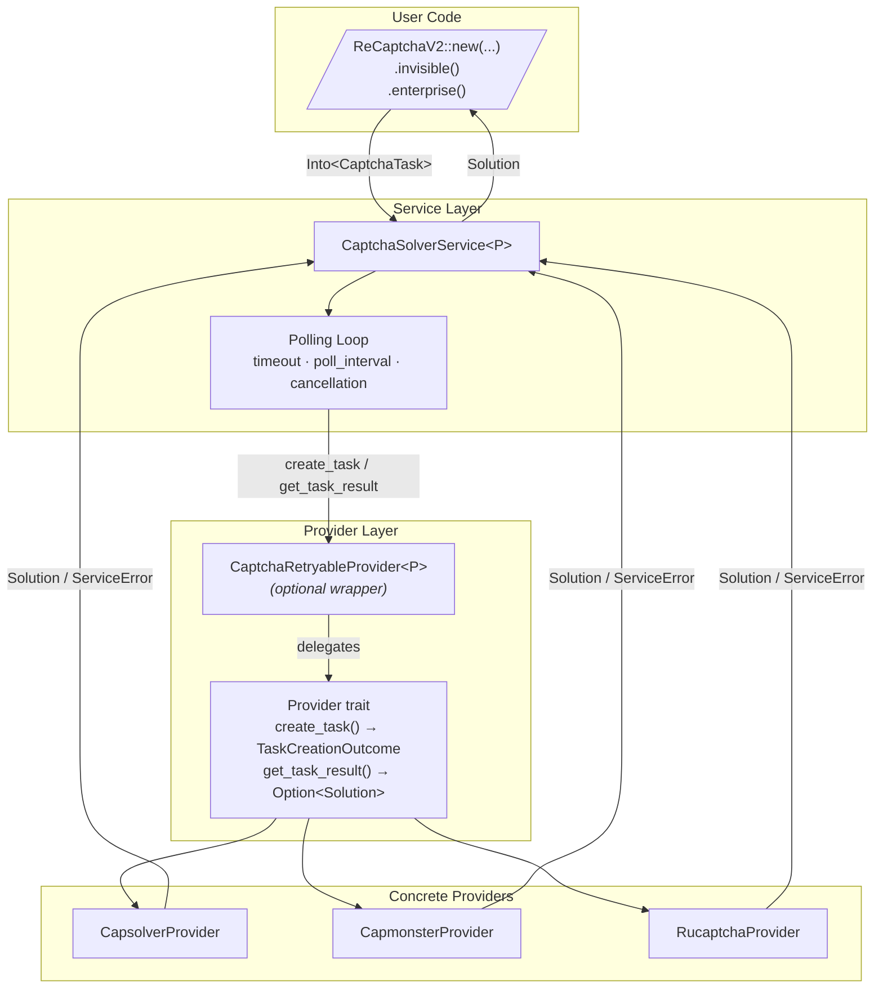
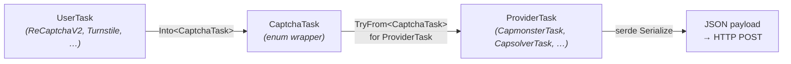
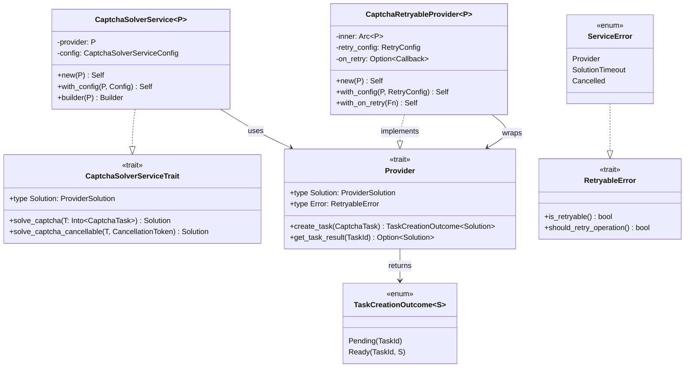
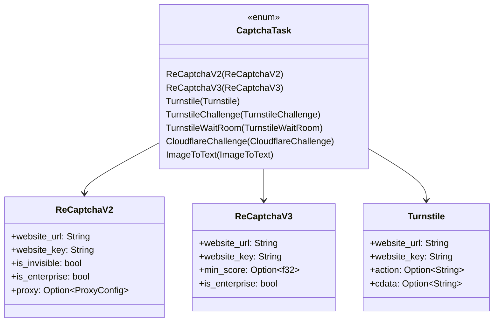
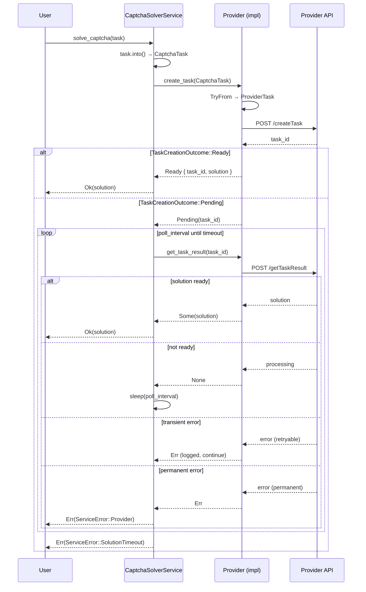
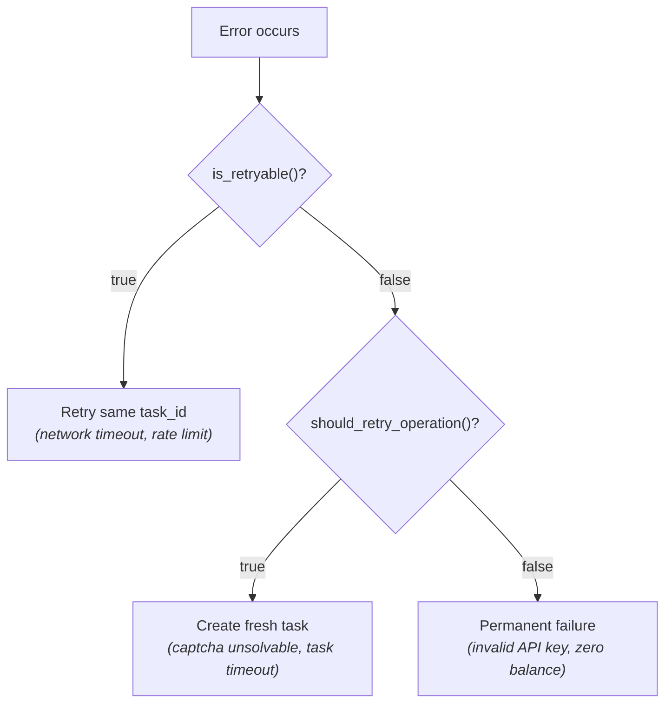

# Architecture

## Overview

`captcha-solvers` is a provider-agnostic captcha solving library. Users work with shared task types and a unified service layer; the library routes tasks to provider-specific APIs via the `Provider` trait.

## High-Level Flow



## Task Conversion Pipeline

Each shared task type goes through a two-step conversion before reaching the provider API:



- `Into<CaptchaTask>` — infallible, wraps the user task in the unified enum.
- `TryFrom<CaptchaTask> for ProviderTask` — fallible. Returns `UnsupportedTaskError` if the provider doesn't support the task type or specific field combinations.

## Core Types



## CaptchaTask Enum



## Solving Lifecycle (Sequence)



## Error Classification



Two-level retryability:
- **`is_retryable()`** — same task_id can be polled again (transient network errors).
- **`should_retry_operation()`** — a brand new `solve_captcha()` call might succeed (captcha was unsolvable, but next one might work).

## Provider Support Matrix

| Task Type | Capsolver | CapMonster | RuCaptcha |
|-----------|-----------|------------|-----------|
| ReCaptchaV2 | Yes | Yes | Yes |
| ReCaptchaV3 | Yes | Yes | Yes |
| Turnstile | Yes | Yes | Yes |
| TurnstileChallenge | — | Yes | — |
| TurnstileWaitRoom | — | Yes | — |
| CloudflareChallenge | Yes | — | — |
| ImageToText | Yes | Yes | Yes |

## Module Layout

```
src/
├── lib.rs                      # Public API re-exports
├── errors.rs                   # UnsupportedTaskError, RetryableError trait
├── solutions.rs                # Shared solution types (ReCaptchaSolution, TurnstileSolution, …)
├── tasks/                      # Shared task types with builder pattern
│   ├── mod.rs                  # CaptchaTask enum + From impls
│   ├── recaptcha.rs            # ReCaptchaV2, ReCaptchaV3
│   ├── cloudflare.rs           # Turnstile, CloudflareChallenge
│   ├── turnstile_challenge.rs  # TurnstileChallenge
│   ├── turnstile_waitroom.rs   # TurnstileWaitRoom
│   └── image_to_text.rs        # ImageToText
├── providers/
│   ├── mod.rs                  # Re-exports
│   ├── traits.rs               # Provider trait, TaskCreationOutcome
│   ├── retryable/
│   │   └── mod.rs              # CaptchaRetryableProvider wrapper
│   ├── capsolver/              # Capsolver implementation
│   │   ├── mod.rs
│   │   ├── provider.rs         # CapsolverProvider + Provider impl
│   │   ├── types.rs            # CapsolverTask enum + TryFrom + CapsolverSolution
│   │   ├── errors.rs           # CapsolverError + RetryableError impl
│   │   ├── response.rs         # API response parsing
│   │   └── tests.rs            # wiremock-based tests
│   ├── capmonster/             # CapMonster Cloud implementation (same structure)
│   └── rucaptcha/              # RuCaptcha implementation (same structure)
├── service/
│   ├── mod.rs                  # Module re-exports
│   ├── structure.rs            # CaptchaSolverService + polling loop
│   ├── traits.rs               # CaptchaSolverServiceTrait
│   ├── config.rs               # Config + presets (fast/balanced/patient)
│   ├── errors.rs               # ServiceError
│   └── tests.rs                # MockProvider-based tests
└── utils/
    ├── mod.rs                  # Module re-exports
    ├── proxy.rs                # ProxyConfig, ApiProxyFields, RucaptchaProxyFields
    ├── retry.rs                # RetryConfig (backon wrapper)
    ├── types.rs                # TaskId newtype
    ├── serde_helpers.rs        # String/number deserialization helpers
    ├── response.rs             # Shared HTTP response helpers
    ├── error_chain.rs          # Error chain formatting utilities
    └── span_status.rs          # OpenTelemetry span status helpers
```

## Feature Flags

| Feature | Default | Description |
|---------|---------|-------------|
| `capsolver` | Yes | Capsolver provider |
| `capmonster` | Yes | CapMonster Cloud provider |
| `rucaptcha` | Yes | RuCaptcha provider |
| `tracing` | Yes | OpenTelemetry tracing instrumentation |
| `metrics` | No | OpenTelemetry metrics (counters, histograms) |
| `native-tls` | Yes | System TLS backend |
| `rustls-tls` | No | Rustls TLS backend |
